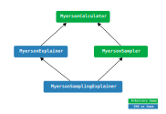

Documentation - Myerson package
===============================

The Myerson values can be calculated using different classes.
The base class calculates Myerson values for arbitrary games, an inheriting class
can also approximate the Myerson value through Monte Carlo sampling of the player coalitions.
From the base calculator class the explainer and sampling explainer classes inherit most functionality,
however, the graph and coalition functions in these classes are expected to be ``pytorch_geometric`` graphs
``pytorch`` modules, respectively.

   Inheritance diagram of the Myerson module classes.

Calculate the Myerson value for arbitrary games
-----------------------------------------------

.. autoclass:: myerson.MyersonCalculator
    :members:

.. autoclass:: myerson.MyersonSampler
    :members:

Explain GNNs with Myerson values
--------------------------------

.. autofunction:: myerson.explain

.. autoclass:: myerson.MyersonExplainer
    :members:

.. autoclass:: myerson.MyersonSamplingExplainer
    :members: