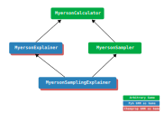

Documentation - Myerson package
===============================

The Myerson values can be calculated using different classes.
The base class calculates Myerson values for arbitrary games, an inheriting class
can also approximate the Myerson value through Monte Carlo sampling of the player coalitions.
From the base calculator class the explainer and sampling explainer classes inherit most functionality.
However, depending on the module used (``pyg_explain`` or ``chemprop_explain``), the graph and coalition functions 
are expected to be ``pytorch_geometric`` or ``chemprop`` graphs and their respective neural network modules.

   Inheritance diagram of the Myerson module classes.

Calculate the Myerson value for arbitrary games
-----------------------------------------------

.. autoclass:: myerson.MyersonCalculator
    :members:

.. autoclass:: myerson.MyersonSampler
    :members:

Explain PyG GNNs with Myerson values
------------------------------------

.. autofunction:: myerson.pyg_explain.explain

.. autoclass:: myerson.pyg_explain.MyersonExplainer
    :members:

.. autoclass:: myerson.pyg_explain.MyersonSamplingExplainer
    :members:

.. autoclass:: myerson.pyg_explain.MyersonClassExplainer
    :members:

.. autoclass:: myerson.pyg_explain.MyersonSamplingClassExplainer
    :members:

Explain Chemprop Models with Myerson values
-------------------------------------------

.. autofunction:: myerson.chemprop_explain.explain

.. autoclass:: myerson.chemprop_explain.MyersonExplainer
    :members:

.. autoclass:: myerson.chemprop_explain.MyersonSamplingExplainer
    :members:

.. autoclass:: myerson.chemprop_explain.MyersonClassExplainer
    :members:

.. autoclass:: myerson.chemprop_explain.MyersonSamplingClassExplainer
    :members: