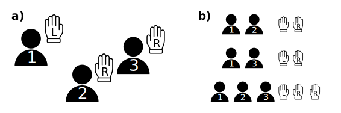

Get Started
===========

Skip the introduction and go directly to the :ref:`code examples <code_examples>`.

A Brief Introduction to Cooperative Game Theory
-----------------------------------------------

A solution concept in cooperative game theory is a method for how the payoff of the game can be allocated among the players.
While the popular solution concept of the *Shapley values* assumes that all players can cooperate, the *Myerson values* restrict player cooperation. 
Here, the cooperation structure is modeled by a graph, where links between nodes indicate the ability to cooperate. 
A game itself is defined by a the *coalition function*, which is best explained by an example game.

The Gloves Game
^^^^^^^^^^^^^^^

In the gloves game, players have either a right or a left glove.
A pair of gloves is worth :math:`1` while a single glove is worth :math:`0`.
For our example, we'll look at three players, one with a left glove and two with a right glove (**Figure 1a**).

    **Figure 1: a)** The gloves game with three players. In this example player :math:`1` has a right glove and players :math:`2` and :math:`3` have left gloves each. **b)** All coalitions that generate value.

So there are three coalitions with a payoff of :math:`1` (**Figure 1b**), all other coalitions are :math:`0`.
The coalition function :math:`v` can be defined as:

.. math::
    v_{L,R}\,(S) =
    \begin{cases}
    1 & \text{if $S \in \{\{1,2\},\{1,3\},\{1,2,3\}\}$;} \\
    0 & \text{otherwise.}
    \end{cases}

There are :math:`2^N = 2^3 = 8` possible coalitions :math:`S` for our example:

.. math::

    \begin{array}{ll}
    \{\emptyset\} & \{1,2\}\\
        \{1\}  & \{1,3\}\\
        \{2\}  & \{2,3 \}\\
        \{3\}  & \{1,2,3 \}\\
    \end{array}

The Shapley Value
"""""""""""""""""

The Shapley value for a single player can then be calculated using the following formula:

.. math::

    \text{Sh}_i\,({v}) = \frac{1}{|N|!}\; \sum_R \big({v}\,(P_i^R \cup \{i\}) - {v}(P_i^R)\big)

Here, :math:`P_i^R \cup \{i\}` denotes the set of players in the order :math:`R` including player :math:`i`.
**So for every possible coalition in every possible order, we look at the contribution that the player adds. This is called the players marginal contribution.** 
Note that the formula can be simplified to go from factorial complexity to exponetial complexity (see :ref:`Documentation <Documentation - Myerson package>`).

Using the formula, we can calculate the Shapley value for player :math:`1`:

.. math::

    \begin{align*}
        \text{Sh}_1\,(v) &= \frac{1}{3!}\,\Big((v(\{1\}) - v(\emptyset)) & \overbrace{(1,2,3)}^R\\
        &\quad+(v(\{1\}) - v(\emptyset)) & (1,3,2)\\
        &\quad+(v(\{2,1\}) - v(\{2\})) & (2,1,3)\\
        &\quad+(v(\{2,3,1\}) - v(\{2,3\})) & (2,3,1)\\
        &\quad+(v(\{3,1\}) - v(\{3\})) & (3,1,2)\\
        &\quad+(v(\{3,2,1\}) - v(\{3,2\}))\Big) & (3,2,1)\\
        &=\frac{1}{3!}\,(0+0+1+1+1+1) \\
        &=\frac{2}{3}
    \end{align*}

In the order :math:`(2,3,1)` the players :math:`2` and :math:`3` have a right glove each, so they can generate a value of :math:`v(\{2,3\}) = 0`. Together with player :math:`1` they can form a pair of gloves and thus generate a value of :math:`v(\{2,3,1\} = 1`, so the marginal contribution player :math:`1` makes for this ordering is :math:`1`.

The Shapley value for players :math:`2` and :math:`3` is :math:`\text{Sh}_2\,(v) = \text{Sh}_3\,(v) = \frac{1}{6}`. This aligns with the intuitive expectation of player :math:`1` contributing more because they bring the only left glove. Additionally, players :math:`2` and :math:`3` bring the same glove and can otherwise not be distinguished from each other, so they contribute equally to the overall worth.

The Myerson Value
"""""""""""""""""

*Myerson* introduced the idea of regulate the players ability to cooperate by introducing a graph structure (**Figure 2**). 

    **Figure 2:** A possible cooperation structure for the gloves game.

The player coalitions can only cooperate if they are linked in the graph :math:`G`.
The Myerson value is then the Shapley value of the graph restricted game:

.. math::

    \text{My}_i(v, \mathcal{G}) = \text{Sh}_i(v/\mathcal{G})

For our example we calculate the Myerson values as follows (differences to the Shapley values highlighted in bold):

.. math::

    \begin{align*}
        \text{My}_1\,(v, \mathcal{G}) &= \frac{1}{3!}\,\Big((v(\{1\}) - v(\emptyset)) & \overbrace{(1,2,3)}^R\\
        &\quad+(v(\{1\}) - v(\emptyset)) & (1,3,2)\\
        &\quad+(v(\{2,1\}) - v(\{2\})) & (2,1,3)\\
        &\quad+(v(\{2,3,1\}) - v(\{2,3\})) & (2,3,1)\\
        &\quad+(\boldsymbol{[v(\{3\})+v(\{1\})]} - v(\{3\})) & (3,1,2)\\
        &\quad+(v(\{3,2,1\}) - v(\{3,2\}))\Big) & (3,2,1)\\ 
        &=\frac{1}{3!}\,(0+0+1+1+\boldsymbol{0}+1) \\
        &=\boldsymbol{\frac{1}{2}}
    \end{align*}

For players :math:`2` and :math:`3` this results in :math:`\text{My}_2\,(v) = \frac{1}{2}` and :math:`\text{My}_3\,(v) = 0`, respectively. With the cooperation structure enforced, player :math:`2` profits from his central role, linking the other two players. Now player :math:`3` can only contribute to the overall gain when player :math:`2` is present, who has the same glove, thus player :math:`3` does not contribute anything. In a complete graph the Myerson value is equivalent to the Shapley value.

.. _code_examples:

Code Examples
-------------

Calculate the Myerson Values Game Theory
^^^^^^^^^^^^^^^^^^^^^^^^^^^^^^^^^^^^^^^^

- explain the gloves game
- picture
- latex formula for handcalculation
- code 

Calculation of the three player example for the gloves game (*vide supra*).

.. code-block:: python
    
    example = "example text"

Explain a GNN Prediction Exactly
^^^^^^^^^^^^^^^^^^^^^^^^^^^^^^^^^

- description
- code

Approximate Explanations for a GNN Prediction 
^^^^^^^^^^^^^^^^^^^^^^^^^^^^^^^^^^^^^^^^^^^^^

- description
- code

Visualizing Explanations on Molecular Structures
^^^^^^^^^^^^^^^^^^^^^^^^^^^^^^^^^^^^^^^^^^^^^^^^